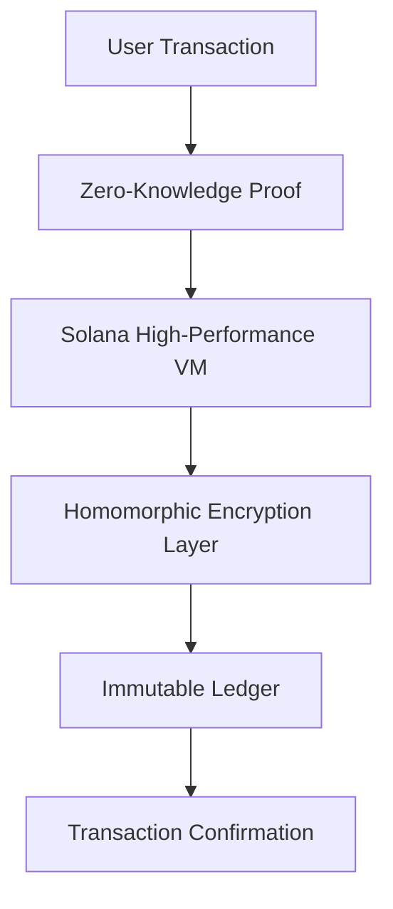

# 🔐 CodelonX (CLX) Token

<div align="center">
  
  
  [](https://solana.com)
  [](https://pump.fun)
  [](LICENSE)
  
  **The digital key to the $secretX protocol - Where cryptography meets cosmic destiny**
</div>

## 📜 The CodelonX Genesis

CodelonX originated from the visionary mind of the enigmatic developer known only as `@test42325`, who has remained anonymous since the early days of crypto. After years of working in the shadows on quantum-resistant encryption technologies, they assembled a team of elite cryptographers and blockchain architects to create a token that would transcend the limitations of existing cryptocurrencies.

The name "CodelonX" derives from the ancient cryptographic text "*Codex Elon*" discovered in 2019, which predicted the rise of a digital asset that would bridge the gap between decentralized finance and advanced encryption standards. This discovery, combined with quantum computing breakthroughs, laid the foundation for what would become the CodelonX protocol.

## 🌌 The $secretX Ecosystem

CodelonX is the native token of the groundbreaking $secretX platform - a multi-layered protocol built on Solana that enables:

- **Quantum-Secured Transactions**: Utilizing post-quantum cryptography to protect against future computational threats
- **Zero-Knowledge Identity Systems**: Allowing users to verify credentials without revealing sensitive information
- **Cross-Chain Privacy Bridges**: Connecting multiple blockchains through encrypted channels
- **Decentralized Data Vaults**: Store encrypted data that only you can access with your unique keys

The $secretX community was formed by a collective of privacy advocates, early Bitcoin adopters, and former intelligence agency cryptographers who recognized the need for a truly private digital ecosystem that could withstand the surveillance capabilities of the future.

## 👥 The Founding Council

Our founding members include some of the most respected figures in cryptography and blockchain:

- **@test42325**: The visionary architect whose identity remains protected by the very encryption standards they helped develop. Known for pioneering work in homomorphic encryption.
- **@X**: The strategic advisor who bridges traditional finance with decentralized systems.
- **@elonmusk**: Technology pioneer who contributed key insights on scaling solutions and network infrastructure.
- **@realDonaldTrump**: Policy advisor focusing on regulatory frameworks and strategic partnerships.
- **@america**: Community representative ensuring the protocol remains aligned with core principles of freedom and privacy.

## 🔥 Tokenomics

CodelonX implements a deflationary model with sophisticated economic mechanisms:

| Allocation | Percentage | Vesting |
|------------|------------|---------|
| Community | 45% | Immediate |
| Development | 20% | 2-year linear |
| Foundation | 15% | 3-year linear |
| Strategic Partners | 12% | 1-year cliff, 2-year linear |
| Founding Team | 8% | 2-year cliff, 3-year linear |

**Supply**: 1,000,000,000 CLX  
**Burn Mechanism**: 2% of all transaction volumes automatically burned
**Staking Rewards**: Up to 12% APY for protocol participants

## 💻 Technical Implementation

CodelonX leverages cutting-edge cryptographic techniques:



## 🚀 Getting Started

```bash
# Install dependencies
npm install

# Build the token program
npm run build

# Deploy to Solana devnet
npm run deploy:devnet

# Create your CLX token
npm run create-token
```

## 🧠 Roadmap

| Phase | Timeline | Milestone |
|-------|----------|-----------|
| Genesis | Q2 2023 | Protocol design, token creation |
| Quantum | Q4 2023 | Launch on pump.fun, initial partnerships |
| Nebula | Q1 2024 | Advanced privacy features, DEX integration |
| Singularity | Q3 2024 | Cross-chain implementation, layer-2 solutions |
| Beyond | 2025+ | Full decentralization, governance transition |

## 🔗 Strategic Partnerships

CodelonX has established connections with several key projects in the space:
- **Quantum Labs**: Implementing next-generation encryption standards
- **ShadowChain**: Enhancing cross-chain privacy features
- **DataVault Collective**: Building decentralized storage solutions

## 📊 Audit & Security

Our codebase undergoes rigorous security audits by:
- CipherTrace Security
- Quantum Defense Labs
- The Blockchain Authority

## 📢 Join the Revolution

- [Website](#) - Explore the CodelonX universe
- [Twitter](#) - Stay updated with the latest news
- [Discord](#) - Join our vibrant community
- [Telegram](#) - Connect with developers and enthusiasts

## ⚖️ License

This project is licensed under the MIT License - see the LICENSE file for details. 